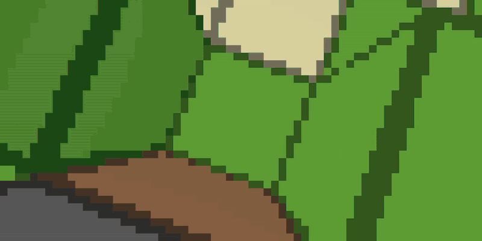

# netherite

From-scratch C Minecraft **1.11.2** (bit-verified vs the real Java game), with
CUDA on Linux, Metal on Apple Silicon, and batched RL.

<p align="center">
  
</p>
<p align="center"><i>One env's semantic camera, zooming out to 7,200 live
worlds stepping in lockstep on one GPU (recorded from a real batch).</i></p>

## Platforms

| | Support |
|--|---------|
| **Linux x86_64** | Full stack (CPU/CUDA build and train, Java oracle). Canonical CUDA host: anvil. |
| **macOS arm64** | Native C game, CPU/Metal raster, Metal-assisted blaze, PyTorch MPS smoke training, and CPU/Metal parity gates. |
| **Windows** | Not supported as a build host. |

No Mojang content is shipped. You need legal Minecraft ownership. JDK 8 is
needed for live Java-oracle work, but not for the native macOS CPU/Metal stack.

## Using an LLM on this repo

Open **[`AGENTS.md`](AGENTS.md)** (Claude also loads [`CLAUDE.md`](CLAUDE.md)). Or paste:

```
Read AGENTS.md in this repo and follow it. Task: <what you want done>
```

## Clean Linux box (one command)

```bash
bash scripts/setup_and_verify.sh          # bootstrap + build + --quick sweep
bash scripts/setup_and_verify.sh --demo   # + physics/pixel tape replay + SBS MP4
# -> demos/pixel_match_sbs.mp4  (oracle | magma side-by-side)
```

Prism is optional. Bootstrap uses ForgeGradle; details in [`docs/BOOTSTRAP.md`](docs/BOOTSTRAP.md).
Pixel demo uses the shipped canonical tape under `c/magma/raster/verify/demo/`.

## Clean Apple Silicon Mac (one command)

```bash
bash scripts/setup_macos.sh          # legal assets + native build + quick gates
bash scripts/setup_macos.sh --full   # broader CPU/Metal pyramid + benchmarks

# Native playable game, with an explicit backend:
c/magma/magma_game_metal --backend metal --world superflat --view-distance 4
```

The Metal shaders compile through the runtime, so Xcode's optional offline
Metal Toolchain component is not required. See
[`docs/MACOS_METAL.md`](docs/MACOS_METAL.md) for architecture, memory sizing,
training commands, measured results, and the deliberate FP64 boundary.
