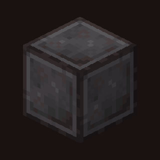

<p align="center">
  
</p>

# netherite

From-scratch C/CUDA Minecraft **1.11.2** (bit-verified vs the real Java game) +
batched CUDA RL.

## Platforms

| | Support |
|--|---------|
| **Linux x86_64** | Full stack (build, CUDA train, Java oracle). Canonical: anvil. |
| **macOS** | Viewer / SSH only (Moonlight, mcwindow). No native game or CUDA train. |
| **Windows** | Not supported as a build host. |

No Mojang content is shipped. You need a legal Minecraft ownership and JDK 8.

## Using an LLM on this repo

Open **[`AGENTS.md`](AGENTS.md)** (Claude also loads [`CLAUDE.md`](CLAUDE.md)). Or paste:

```
Read AGENTS.md in this repo and follow it. Task: <what you want done>
```

## Clean Linux box (one command)

```bash
bash scripts/setup_and_verify.sh          # bootstrap + build + --quick sweep
bash scripts/setup_and_verify.sh --demo   # + physics/pixel tape replay + SBS MP4
# -> demos/pixel_match_sbs.mp4  (oracle | craster side-by-side)
```

Prism is optional. Bootstrap uses ForgeGradle; details in [`docs/BOOTSTRAP.md`](docs/BOOTSTRAP.md).
Pixel demo uses the shipped canonical tape under `c/craster/raster/verify/demo/`.
