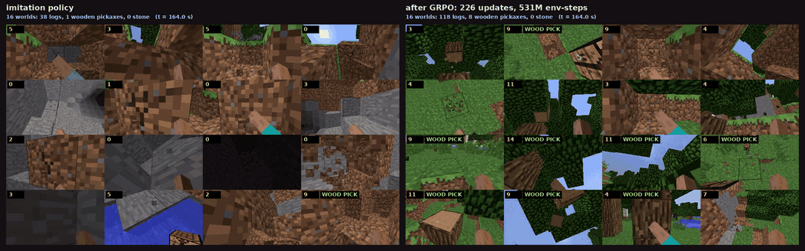

# netherite

Minecraft 1.7.10 rewritten in C and CUDA, exact against the real Java client, fast enough to train agents on.

<p align="center">
  
</p>
<p align="center"><i>Sixteen seed-1 worlds, three minutes in: the imitation policy (left) and the same policy after
226 GRPO updates (right). Every frame is the C engine's. Still: <a href="docs/demo.png">docs/demo.png</a>.</i></p>

- **Exact.** All 874 in-scope vanilla source files are ported and checked bit for bit against the Java client
  (`index/summary.json`), and the seed-42 golden chain plays from a fresh world to the dragon's death with every
  row of every tick equal to Java's (`csrc/play/chain.sh`).
- **Fast.** 30.9k env-steps/s with observations while a 181M-parameter policy learns, on 4 GPUs (DEVLOG.md,
  2026-10-01, the overnight GRPO run).
- **Learnable.** GRPO took the wooden pickaxe from 6.7% to 49% of episodes on seed 1 (same entry), and from 7.8%
  to 36.5% on 16 seeds it never trained on (DEVLOG.md, 2026-10-01, lane/seedgen).

You need your own copy of Minecraft 1.7.10 (installed once with the official launcher) and JDK 8. No Mojang
content is in this repo: the oracle's source and the textures are rebuilt from your install by `netherite setup`.

## Quickstart

```bash
make                            # builds out/bin/netherite
out/bin/netherite setup         # finds your 1.7.10, rebuilds the oracle and textures from it, builds everything
out/bin/netherite gate --quick  # the Java client records, the C engine replays it row for row
```

Then `netherite play` plays the C engine's client and checks your session against Java when you quit;
`netherite help` lists the rest (check, bench, gate, train, demo). Linux and macOS; the GPU paths need Linux,
CUDA and clang.

If you are an agent reading this, read [AGENTS.md](AGENTS.md) first: it tells you how to build, check and report
to your user.
